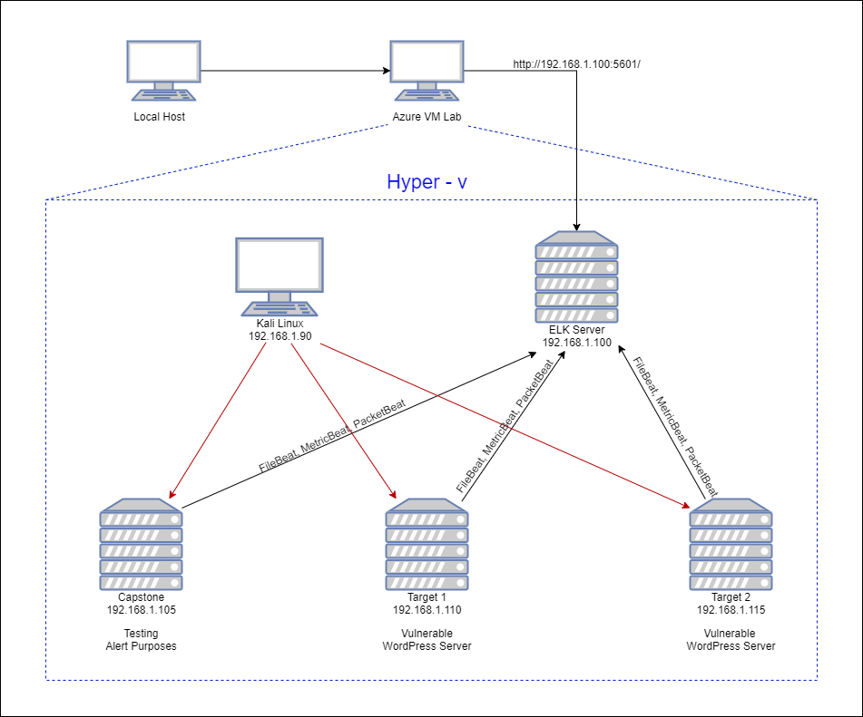
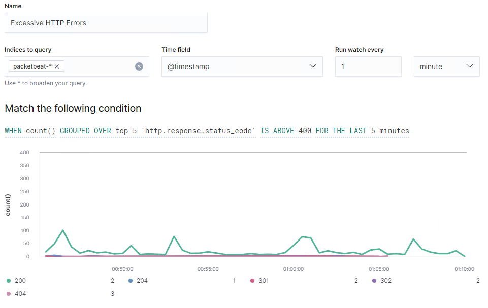
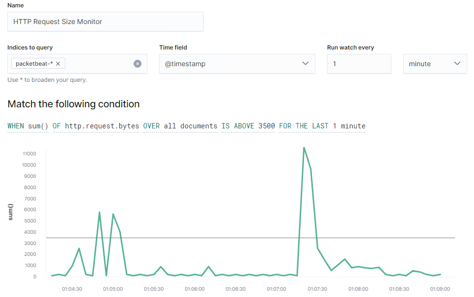
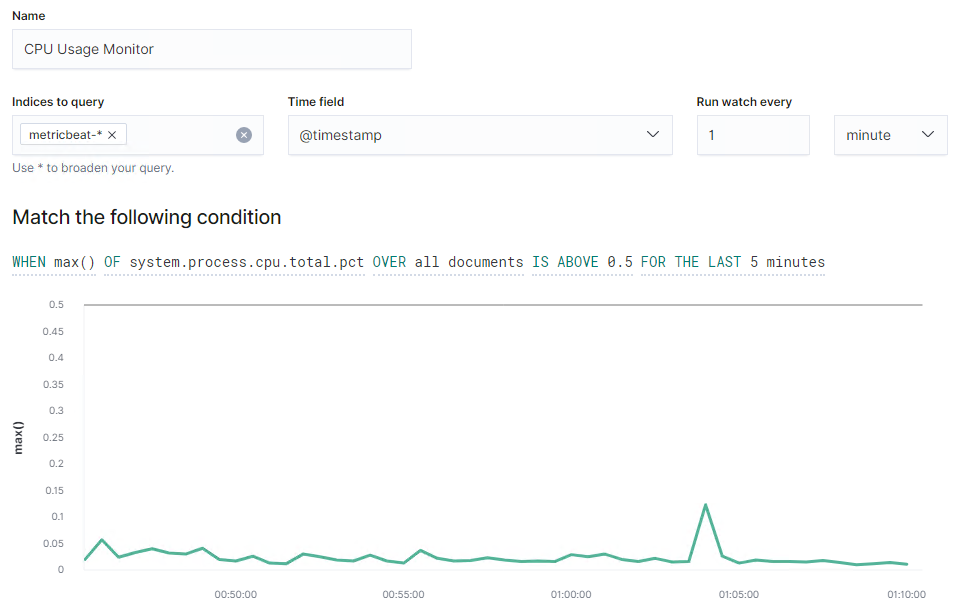

# Blue Team: Summary of Operations

## Table of Contents
- Network Topology
- Description of Targets
- Monitoring the Targets
- Patterns of Traffic & Behavior
- Suggestions for Going Further

 

### Network Topology

The following machines were identified on the network:
- Kali
  - **Operating System**: Linux 2.6.32
  - **Purpose**: Tool to Penetrate vulnerable webservers
  - **IP Address**: 192.168.1.110
- ELK
  - **Operating System**: Linux
  - **Purpose**: Deployed ELK server to collect Logs of FileBeat, MetricBeat, and PacketBeat from the targed webservers
  - **IP Address**: 192.168.1.110
- Capstone
  - **Operating System**: Linux
  - **Purpose**: Testing Alert Purposes (for ELK server)
  - **IP Address**: 192.168.1.110
- Target 1
  - **Operating System**: Linux
  - **Purpose**: Vulnerable WordPress Server 1
  - **IP Address**: 192.168.1.110
- Target 2
  - **Operating System**: Linux
  - **Purpose**: Vulnerable WordPRess Server 2 (Advanced)
  - **IP Address**: 192.168.1.115

 
 

### Description of Targets

The target of this attack was: `Target 1` (192.168.1.110).

Target 1 is an Apache web server and has SSH enabled, so ports 80 and 22 are possible ports of entry for attackers. As such, the following alerts have been implemented:
  - **SSH Log in Alert**
    - Monitor for SSH credentials bruteforce attack
    - Monitor for SSH port for unauthorized access.
    - Alert should trigger when user attempts to access system over Port 22.
  - **SQL Database Alert**
    - Monitor traffic for unauthorized attempts to access SQL Database
    - Alert should trigger when external/unauthorized IP connections are made to the SQL Database or any related files
  - **Privilege Escalation Alert**
    - Monitor unauthorized root access attempts
    - Alert should trigger when unauthorized sudo command usage or privileged directory/files are attempted for access by unautorized users.

 
 

### Monitoring the Targets

Traffic to these services should be carefully monitored. To this end, we have implemented the alerts below:

 

#### Excessive HTTP Errors Alerts
`Excessive HTTP Error` is implemented as follows:
  - **Metric**: packetbeat
  - **Threshold**: `http.response.status_code`is above 400 for last 5 minutes
  - **Vulnerability Mitigated**: Bruteforce Attacks, DoS Attacks
  - **Reliability**: This would be high reliability as this alert would generate lots of True Positives. With the Threshhold set with certain time, this would definately help with the alert system.
  - `WHEN count() GROUPED OVER top 5 'http.response.status_code' IS ABOVE 400 FOR THE LAST 5 minutes`
  

 

#### HTTP Request Size Monitor
`HTTP Request Size` is implemented as follows:
  - **Metric**: Packetbeat
  - **Threshold**: `http.request.bytes` is above 3500 For the Last 1 minute
  - **Vulnerability Mitigated**: large Files that are being transferred, HTTP request Smuggling Vulnerability
  - **Reliability**: This would be medium reliability, as alerts would generate somewhat of false positives. There might be a large file that is being transferred over within the network for work purposes. It's not too reliable to catch the the malicious files.
  - `WHEN sum() of http.request.bytes OVER all documents IS ABOVE 3500 FOR THE LAST 1 minute`
  

 

#### CPU Usage Monitor
`CPU Usage` is implemented as follows:
  - **Metric**: Metricbeat
  - **Threshold**: `system.process.cpu.total.pct` is above 0.5 for the last 5 minutes
  - **Vulnerability Mitigated**: DoS Attacks
  - **Reliability**: This would be low reliability, as so many alearts would generate with falt positives. CPU could spike up when there are alot of resources being consumed due to many different reasons.
   - `WHEN max() OF system.process.cpu.total.pct OVER all documents IS ABOVE 0.5 FOR THE LAST 5 minutes`
   

 
 

### Suggestions for Going Further

The logs and alerts generated during the assessment suggest that this network is susceptible to several active threats, identified by the alerts above. In addition to watching for occurrences of such threats, the network should be hardened against them. The Blue Team suggests that IT implement the fixes below to protect the network:
- <u> Wordpress User Enumeration Vulnerabilities </u>
  - **Patch 1**: use a free plugin "WP Hardening" to disable User Enumeration in WordPress
    - Install and activate plugin > 'Security Fixers' tab > Stop user enumeration.
    - **Why It Works**: By disabling User Enumeration function, it will stop the attacker to enumerate user lists.
- <u> Open Port 22 SSH & Weak Password Vulnerabilities </u>
  - **Patch 1**: Recommand to disallow access vis Port 22 OpenSSH.
    - **Why It Works**: Closing this port would disable the SSH connections to the server, preventing the unauthorized access.
    - IF this SSH port needs to be open for a specific reason, implement whitelisting for firewall configuration for this server so that only authorized can have access to the the openSSH port.
  - **Patch 2**: Hardening password policy should be in place.
    - **Why It Works**: The Red Team was able to penetrate michael's account so easily as the password was so simple, and easy to guess. This can be mitigated if we implement somekind of policy for passwords that would help employees to come up with complicated passwords. 
    - Also, it would be a good fit if there is an education seminar for security purposes being ran by the organizations to help employees understand importance of security.

- <u> WordPress Configuration & SQL Database Vulnerabilities </u>
  - **Patch**: Recommnded to configure and hash the wordpress database login information in `wp-config.php`.
    - **Why It Works**: By using the encryption, even if unauthorized person gets into the system, they are not easily able to grab the login credentials to access the database.
    - Proprietary information, including hashed passwords, is viewable in plaintext on html pages.

- <u> Previlege Escalation </u>
  - **Patch**: Only give authority to the person who is responsible for.
    - **Why It Works**: By having correct file permissions for user accounts, we can maintain control over assigned roles and permissions for any accounts.
    - Role and permission management is important for preventing vertical or horizontal escalation of privileges to unauthorized users. Bad example was Steven's account's ability to run phython scripting through his login.

- <u> WordPress XML-RPC Related Vulnerabilities </u>
    - **Patch 1**: udpate WordPress to the latest version
      - **Why It Works**: Most of the organization comes out with the latest update patchs. most likely they are security patches, where known vulnerabilities can be mitigated through these patches.- 
    - **Patch 2**: Disable XML-RPC API settings if enabled. 
       - **Why It Works**: `xmlrpc.php` on WordPress site introduces several security vulnerabilities and can be the target of attacks like DDoS Attacks via XML-RPC Pingbacks or Brute Force Attacks via XML-RPC.
       - You can disable them by using a Plugin or have hosting provider disable `xmlrpc.php`.

 
 
 

### Reference
- Rachel McCollin (July 2021) A Complete Guide on xmlrpc.php in WordPress Retrieved from https://kinsta.com/blog/xmlrpc-php/#why-you-should-disable-xmlrpcphp
- Busra Demir (Oct 2020) A Pentester's Guide to HTTP Request Smuggling Retrieved from https://cobalt.io/blog/a-pentesters-guide-to-http-request-smuggling
- Vikas Kundu (Aug, 2021) How to Stop User Enumeration in WordPress? Retrieved from https://www.getastra.com/blog/cms/wordpress-security/stop-user-enumeration/

 
 
 

### <u> Author </u>
My name is [Sooji Lee](https://www.linkedin.com/in/soojilee88/) :)