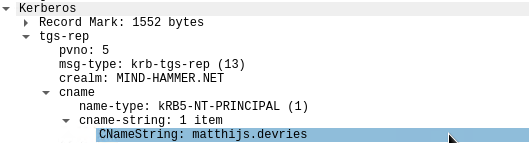

# Network Forensic Analysis Report

## Setup

For This Part of the Project, live traffic within the intranet was captured through wireshark.
- For the purpose of this project,command `systemctl start sniff` was ran which uses `tcpreplay` to replay PCAPs in `/opt/pcaps` onto Kali's `eth0` interface.
- This was then captured for about 15min through wireshark as live traffic.
- Once the live traffic was all captured, command `systemctl stop sniff` was ran to stop the `tcpreply`.
- Then, this capture was saved to a file.

 
 

## Time Thieves 

You must inspect your traffic capture to answer the following questions:

1. What is the domain name of the users' custom site?
    - frank-n-ted.com
    
    - You can also find their name within DHCP packet
    

2. What is the IP address of the Domain Controller (DC) of the AD network?
    - 10.6.12.157
3. What is the name of the malware downloaded to the 10.6.12.203 machine?
    - june11.dll
    
   - Once you have found the file, export it to your Kali machine's desktop.
   - You can download the actual malware file by going to `File > Export Objects > HTTP`
    
4. Upload the file to [VirusTotal.com](https://www.virustotal.com/gui/). 
    - 
5. What kind of malware is this classified as?
    - Trojan Horse

 
 

---

## Vulnerable Windows Machine

1. Find the following information about the infected Windows machine:
    - Host name: ROTTERDAM-PC
    
    - IP address: 172.16.4.205
    
    - MAC address: 00:59:07:b0:63:a4
    
    
2. What is the username of the Windows user whose computer is infected?
    - matthijs.devries
    - Note that for CNameString values for hostnames always end with a $ (dollar sign), while user account names do not.
    
3. What are the IP addresses used in the actual infection traffic?
    - 182.243.115.84
    - For this, you can use `Statistics > Conversation` then, look at the TCP tab.
    - You would look at the most amount of Bytes that the infected windows was communicating to.
    
    - You can also confirm this by looking at the TCP stream. The body of this TCP stream is not clear indicating that it could be infected.
    
4. As a bonus, retrieve the desktop background of the Windows host.
    - For this, you would go to `File > Export Objects > HTTP`
    - The Size of the img is quite large compared to the other image files.
    - In this case, the size of the file can indicate that it's a desktop image, as Desktop Background images are usually high in resolution.
    
    - Once downloaded, you can also look at the property of the file to confirm. 
    - You can see that Image size is 1920x1080 pixels, which is the size that is likely used for desktop images.
    
    - Here is the downloaded Deskbop background image:
    

 
 

---

## Illegal Downloads

1. Find the following information about the machine with IP address `10.0.0.201`:
    - MAC address: 00:16:17:18:66:c8
    - Windows username: elmer.blanco
    
    
    - OS version: Windows NT 10.0; Win64; x64 (Windows 10)
    - For OS version, I've searched for TCP stream in HTTP
    

2. Which torrent file did the user download?
    - Betty_Boop_Rhythm_on_the_Reservation.avi.torrent
    

 
 
 

### <u> Author </u>
My name is [Sooji Lee](https://www.linkedin.com/in/soojilee88/) :)